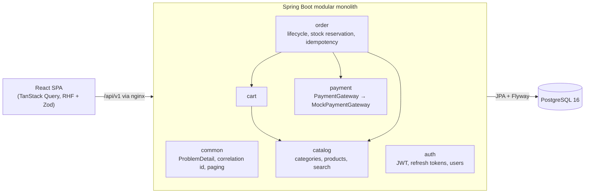
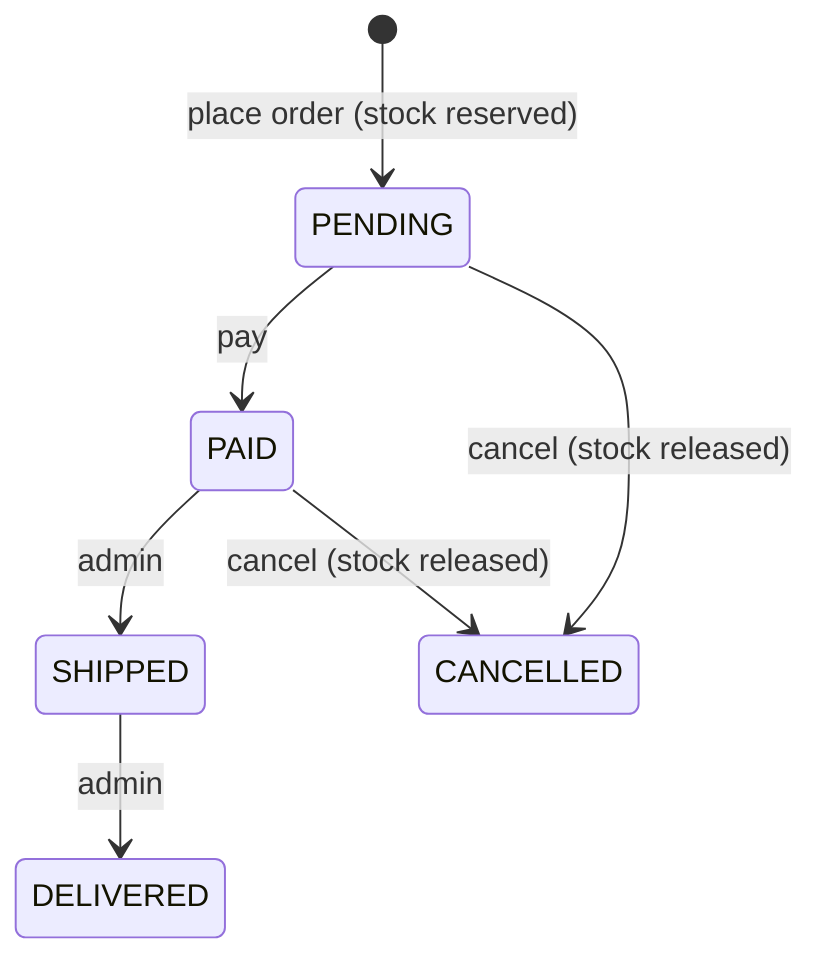

# Architecture

## Modules

Each module has `api/` (controllers, request/response records), `application/` (services), `domain/`
(entities, domain logic, repositories) and, where needed, `infrastructure/` (adapters).

| Module | Responsibility |
|---|---|
| `common` | Global exception handler returning RFC 7807 `ProblemDetail`, correlation-id filter, page response, security config |
| `auth` | Register, login, JWT access tokens, rotating refresh tokens, USER/ADMIN roles, admin seeding |
| `catalog` | Categories, products, public search with filters/sort/pagination, admin CRUD |
| `cart` | One cart per user; add, update, remove with stock checks |
| `order` | Checkout from cart with idempotency key, optimistic-lock stock reservation, status lifecycle, `OrderPlacedEvent` |
| `payment` | `PaymentGateway` interface and the mock implementation |

## Order lifecycle

## Runtime

`docker compose up` starts PostgreSQL (named volume, healthcheck), the backend (starts once the database
is healthy, runs Flyway on boot) and the frontend (static build served by nginx, which proxies `/api`).
